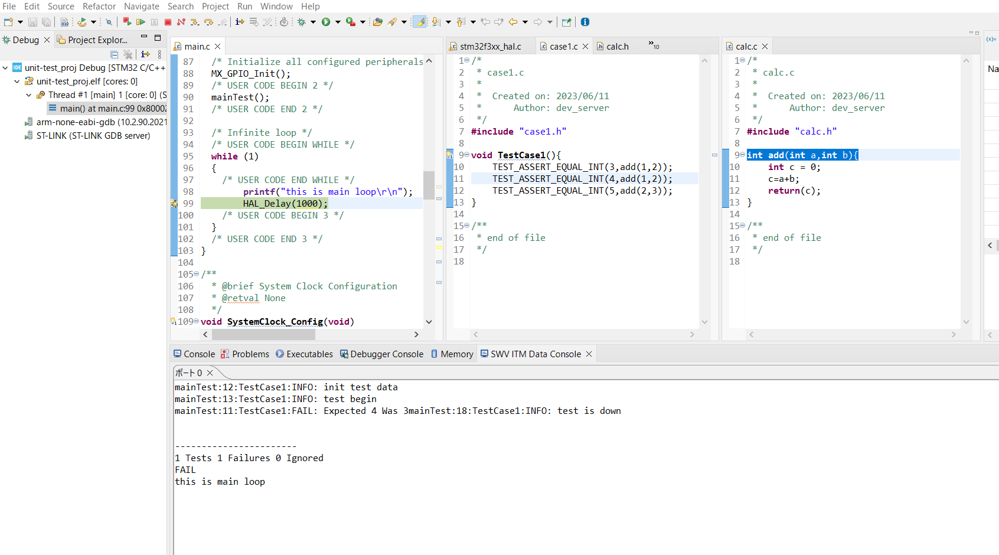
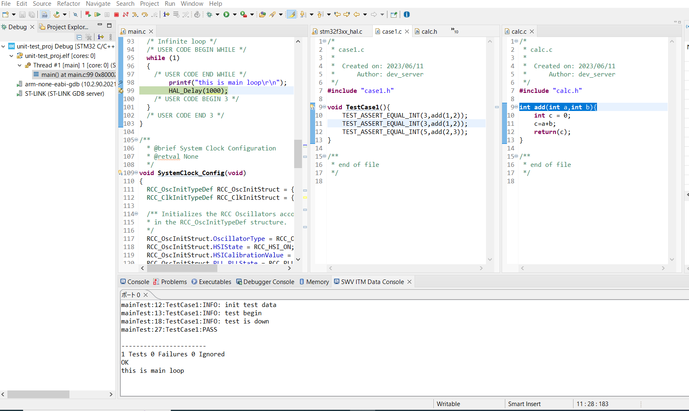

# stm32_unity_test

# このプロジェクトについて
秋月製STM32開発ボード(STM32F303K8T6)
[link](https://akizukidenshi.com/catalog/g/gK-15054/)
でユニットテストのできる環境を作っている。

使用するデバッガは[STlink-V3](https://www.st.com/ja/development-tools/stlink-v3minie.html)

# 目標
RTOS環境でもユニットテストができるようにする。

# 現状
unity testが一応、動く状態となっている。

# 実行環境
- STM32 cube IDE ver 1.12.0